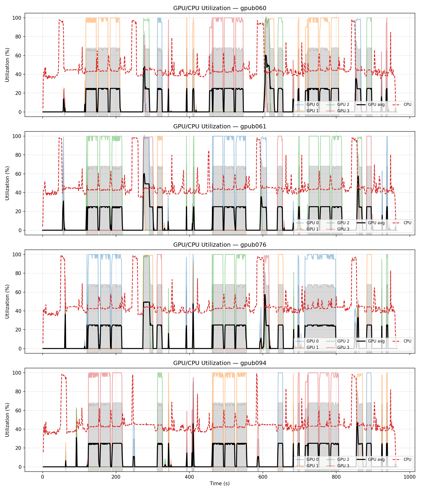

# SGDES — Structure-Guided Deep Evolution Solver

Runs the SGDES protein engineering workflow on HPC GPU nodes (Delta / Bridges-2).
Each mutation target is processed independently and in parallel; results land in
`{outdir}/{mutation}_wd/`.

---

## What the workflow does

SGDES optimises protein sequences for a set of mutation targets using an
iterative loop of three stages:

```
for each foldtune round:
    1. DES     — Deep Evolution Solver generates candidate sequences
    2. Embed   — ESM2-650M embeds all candidates into a vector space
    3. Foldseek — structural similarity screen (ProstT5 fast-folding path)
       ├── createdb: convert FASTA → foldseek DB (generates 3Di SS via ProstT5)
       └── easy-search: compare generated vs. reference structures
    4. Rank    — cosine + L2 distance in embedding space selects the top-k most
                 diverse sequences to seed the next round
```

**DES** (`amortized_bo` / `MutationPredictorSolver`) explores sequence space by
mutating an initial population and scoring each candidate with a
`FoldseekSimilarityProblem` oracle that calls foldseek internally.

**Fast-folding path** (default, `fast_folding: true`): ProstT5 predicts 3Di
secondary-structure tokens directly from sequence — no ESMFold needed, much faster.

**Slow-folding path** (`fast_folding: false`): ESMFold runs first to produce PDB
structures; foldseek then compares them with TM-score alignment.

---

## 1. Environment Setup

Choose the setup script for your cluster and run it **once** (or after changing
dependencies):

| Cluster   | Script                  | Python env   | CUDA          |
|-----------|-------------------------|--------------|---------------|
| Delta     | `delta_env_setup.sh`    | Cray PE venv | HPC SDK 12.8  |
| Bridges-2 | `bridges2_env_setup.sh` | Conda env    | module 12.6.1 |

### Delta (NCSA)

```bash
# Optional: override defaults
bash delta_env_setup.sh \
    --env-dir /u/$USER/conda_env/sgdes \
    --sgdes-dir /scratch/bblj/$USER/SGDES \
    --spherical-dir /scratch/bblj/$USER/SPHERICAL
```

The script clones SGDES and SPHERICAL if not present, creates a Python 3.11 venv
from the Cray PE Python, and installs all dependencies including the foldseek GPU
binary and seqkit.  Requires `cray-python/3.11.7` to be available.

### Bridges-2 (PSC)

```bash
# Set your project directory first
export PROJECT=/ocean/projects/<account>/$USER
bash bridges2_env_setup.sh
```

Load modules before running:
```bash
module load anaconda3
module load cuda/12.6.1
```

The script creates a conda env at `$PROJECT/conda_env/sgdes` with Python 3.11 and
installs PyTorch 2.4.0+cu121, TF, JAX, PyTorch Geometric, flash-attn, TRILL, and
SPHERICAL (editable).

Both scripts pin version-sensitive packages (`numpy<2`, `setuptools<71`,
`tensorboard<2.17`) and print a verification summary at the end.

---

## 2. Apply Runtime Patch (Temporary)

Dragon requires one patch to work correctly with SLURM multi-node jobs.  This
is a **temporary workaround** for an upstream bug that may be fixed in a future
DragonHPC release.  Apply it **once after environment setup**, and again after
any `pip install --upgrade dragonhpc`:

```bash
python apply_slurm_patch.py
```

**`apply_slurm_patch.py`**
Target: `dragon/launcher/wlm/slurm.py`

Replaces Dragon's default `srun --ntasks=N` launch command with
`srun --ntasks-per-node=1 --overlap` so that Dragon's backend processes start
correctly in a SLURM multi-node allocation.

---

## 3. Running

### 3a. Single node — interactive node

On an already-allocated interactive GPU node run:

```bash
bash run_interactive.sh --gpus 4
# or with a custom config:
bash run_interactive.sh --gpus 1 --config config_test.yaml
```

`run_interactive.sh` activates the venv, sets `TOTAL_GPUS`, and launches
`dragon -s` automatically.  Pass `--gpus N` to match the number of GPUs
allocated to the node.

### 3b. Single node — sbatch

Submit via SLURM:
```bash
sbatch delta_gpu_sbatch.sh      # Delta
# sbatch bridges2_gpu_sbatch.sh  # Bridges-2
```

**Example sbatch settings for 1 node × 4 GPUs:**
```sh
#SBATCH --nodes=1
#SBATCH --gpus-per-node=4
```

### 3c. Multi-node — sbatch only

Dragon distributes one mutation worker per GPU; each mutation runs on its
own dedicated GPU.

**Example sbatch settings:**
```sh
#SBATCH --nodes=2             # or 4
#SBATCH --gpus-per-node=1    # 1 GPU per node (see note below)
```

> **Important:** Use `--gpus-per-node=1`, **not** `--gpus=N`.
> `--gpus=N` is a total count that SLURM may satisfy by allocating all GPUs
> to one node, leaving remote nodes with no GPU and causing foldseek to fail
> with *"No GPU devices found"*.

The sbatch script automatically sets `TOTAL_GPUS = nodes × gpus-per-node`
and selects `dragon -s` (single node) or `dragon -m` (multi-node) based on
`SLURM_NNODES`.  No manual edits needed when switching between node counts.

### 3d. Environment variables in the sbatch script

No paths are hardcoded in the Python files.  Set these exports in your sbatch
script before the `dragon` launch line:

| Variable        | Purpose                                                        |
|-----------------|----------------------------------------------------------------|
| `CUDA_HOME`     | CUDA toolkit root; `$CUDA_HOME/lib64` is prepended to `LD_LIBRARY_PATH` on every node, including remote Dragon workers |
| `SGDES_DIR`     | Root of the SGDES/TRILL fork; used to add `amortized_bo` to `sys.path` |
| `SPHERICAL_DIR` | Root of the SPHERICAL repo; added to `sys.path`                |
| `TOTAL_GPUS`    | Total GPUs across all nodes (`nodes × gpus-per-node`); set automatically by the sbatch script from SLURM variables; controls mutation concurrency |

**Delta example (`delta_gpu_sbatch.sh`):**
```sh
export CUDA_HOME=/opt/nvidia/hpc_sdk/Linux_x86_64/25.3/cuda/12.8
export LD_LIBRARY_PATH=$CUDA_HOME/lib64:$LD_LIBRARY_PATH
export SGDES_DIR=/scratch/bblj/$USER/SGDES
export SPHERICAL_DIR=/scratch/bblj/$USER/SPHERICAL
```

**Bridges-2 example (`bridges2_gpu_sbatch.sh`):**
```sh
export CUDA_HOME=/opt/packages/cuda/v12.6.1
export LD_LIBRARY_PATH=$CUDA_HOME/lib64:$LD_LIBRARY_PATH
export SGDES_DIR=$PROJECT/sgdes/SGDES
export SPHERICAL_DIR=$PROJECT/htp/SPHERICAL
```

---

## 4. Configuration Reference (`config.yaml`)

```yaml
# Paths
outdir:    "mayv_output"           # output root; {mutation}_wd/ appended per target
query_dir: ".../splited_mayv"      # directory with one FASTA per mutation target
wt_query:  ".../mayv_ori.fasta"    # wild-type reference sequence

# Execution
engine:          dragon   # "dragon" (HPC) or "concurrent" (local asyncio, no GPU affinity)
# total_gpus is not set here — derived from TOTAL_GPUS env var (nodes × gpus-per-node)
foldtune_rounds: 3        # outer optimisation rounds
fast_folding:    true     # true = ProstT5 3Di (fast); false = ESMFold (slow)
fold_batch_size: 1

# DES hyperparameters
des_rounds:        3      # DES steps per foldtune round
des_batch_size:    100    # candidate sequences evaluated per DES step
des_num_sequences: 50     # top sequences kept after DES
num_mutations:     1      # point mutations per candidate
topk:              10     # sequences forwarded to next round

# Telemetry (independent flags)
collect_nvml_telemetry:   true          # per-node GPU util via NVML; all worker nodes captured
collect_dragon_telemetry: true          # Dragon runtime metrics; dragon engine only
nvml_dir:                 "nvml-telemetry"
dragon_telemetry_dir:     "dragon-telemetry"
nvml_collection_rate:     1.0           # seconds between NVML samples
nvml_checkpoint_interval: 30.0          # seconds between checkpoint flushes

# Mutation targets — uncomment to enable
mutations:
  - T365F
  # - Y155T
  # ...
```

---

## 5. Output Structure

```
{outdir}/
└── T365F_wd/
    ├── T365F_run_experiment_config.json
    ├── T365F_run_foldtune_input_esm2_t33_650M_AVG.csv    # input embeddings
    ├── T365F_run_round1_des.fasta                         # DES candidates
    ├── T365F_run_foldtune_generated_sequences_round1.fasta
    ├── T365F_run_foldtune_foldseek_round1.tsv             # structural similarity
    ├── T365F_run_foldtune_most-distant_round1.fasta       # selected for round 2
    ├── T365F_run_round1_seq_records.csv                   # per-sequence metrics
    ├── T365F_run_round1_eval_*.json                       # round evaluation stats
    └── ...  (rounds 2, 3, …)
nvml-telemetry/                                            # per-node GPU util logs (one file per node)
dragon-telemetry/                                          # Dragon runtime metrics (dragon engine only)
```

---

## 6. Monitoring

SLURM output goes to `slurm-<jobid>.out`.  Key log lines to watch:

```
[T365F] ── Foldtuning round 1/3 ──
[T365F] DES start (ft_round=1  des_rounds=3  batch=100  n_seq=50 ...)
[T365F] foldseek createdb (generated seqs) → ...
[T365F] foldseek easy-search → ...
[T365F] Round 1 eval → struct(bits): min=3047  mean=3110  max=3146
[T365F] ── Round 1 complete  elapsed=...s ──
Done.
```

Two independent telemetry streams are collected when enabled in `config.yaml`:

**NVML telemetry** (`collect_nvml_telemetry: true`) — GPU utilisation and memory
sampled every 1 s, checkpointed every 30 s.  A `NvmlMonitor` is started on each
worker node via Dragon function tasks, so all nodes write to `nvml-telemetry/`
(filenames are hostname-namespaced; no collisions on shared Lustre storage).

**Dragon telemetry** (`collect_dragon_telemetry: true`, dragon engine only) —
Dragon runtime metrics collected via `DragonTelemetryCollector` and written to
`dragon-telemetry/`.

To plot GPU utilization and memory after a run:

```bash
# from the SPHERICAL root
python src/plot/plot_nvml.py \
    --telemetry-dir examples/sgdes/nvml-telemetry \
    --output gpu_util.png
```

This reads `nvml_checkpoint_*.json` files and produces two subplots (compute
utilization and memory usage per GPU) plus a per-GPU summary table.

To plot Dragon runtime metrics:

```bash
python src/plot/plot_dragon.py \
    --telemetry-dir examples/sgdes/dragon-telemetry \
    --output dragon_util.png
```

See the [root README](../../README.md#metrics--visualization) for full plotting
documentation.

---

## 7. Design Notes

**Two `task_description` policy tiers: `_TD_GPU`, `_TD_HOST`**

Every task in `_register_tasks` is pinned to the correct node and/or GPU via
one of two policy templates:

| Template   | Placement   | `gpu_affinity` | Used by                                                      |
|------------|-------------|----------------|--------------------------------------------------------------|
| `_TD_GPU`  | `HOST_NAME` | `[gpu_id]`     | `embed`, `fold`, `foldseek_createdb`, `foldseek_search`      |
| `_TD_HOST` | `HOST_NAME` | *(none)*       | `seqkit_grep`, `seqkit_stats`                                |

**`JAX_PLATFORMS=cpu`**
Forced at import time.  The system cuDNN may be older than what jaxlib was
compiled against; forcing CPU avoids a version-mismatch error on import.

**`TF_FORCE_GPU_ALLOW_GROWTH=true`**
Prevents TensorFlow (used by DES) from pre-allocating ~90% of GPU memory on
first use, which would starve subsequent trill embed calls on the same GPU.

---

## 8. Dragon Scaling

All runs on Delta (NCSA) with identical config (`des_rounds=3`,
`des_batch_size=100`, `des_num_sequences=50`, `foldtune_rounds=3`,
`fast_folding=true`).  Two GPU allocation strategies are compared:

- **1 GPU/node** — one mutation per node, dedicated CPUs/memory per mutation
- **4 GPU/node** — four mutations per node, shared CPUs/memory/Lustre per node

### 8a. 1 GPU per node (2026-04-05)

| Nodes | GPUs/node | Mutations | Workflow | Wall   | Throughput (mut/min) |
|------:|----------:|----------:|---------:|-------:|--------:|
|     1 |         1 |         1 |    443 s |  ~8 m  |    0.14 |
|     2 |         1 |         2 |    484 s |  ~9 m  |    0.25 |
|     4 |         1 |         4 |    517 s |  ~9 m  |    0.46 |

Per-mutation speedup: 2 nodes → 1.8×; 4 nodes → 3.4× (91% / 85% efficiency).

### 8b. 4 GPUs per node (2026-04-07)

| Nodes | GPUs/node | Mutations | Workflow       | Wall    | Throughput (mut/min) |
|------:|----------:|----------:|---------------:|--------:|--------:|
|     1 |         4 |         4 | 545 s (avg×2)  |   9:05  |    0.44 |
|     2 |         4 |         8 |         710 s  |  12:47  |    0.68 |
|     4 |         4 |        16 |         952 s  |  16:54  |    1.01 |

Two 1n×4g runs on the same node (gpub053): 492 s and 597 s — ~20% run-to-run variance
from shared-node load.  All other configs are single runs.

Throughput scaling: 2n×4g → 1.5×; 4n×4g → 2.3× over 1n×4g (77% / 57% efficiency).

### 8c. Round-by-round breakdown

Times shown are per-mutation wall times (all mutations synchronized, finish
within ~1 s of each other).  `4n×1g` = avg of 3 runs; `1n×4g` = avg of 2 runs.

| Round        | 1n×1g | 4n×1g (avg) | 1n×4g (avg) | 2n×4g | 4n×4g |
|:-------------|------:|------------:|------------:|------:|------:|
| **R1 total** | 189 s |       227 s |       230 s | 329 s | 447 s |
| **R2 total** | 136 s |       153 s |       147 s | 195 s | 262 s |
| **R3 total** | 119 s |       149 s |       169 s | 186 s | 242 s |
| **Total**    | **443 s** | **528 s** | **545 s** | **710 s** | **952 s** |

### 8d. Observations

**1n×4g ≈ 4n×1g — foldseek CPU contention offsets Dragon overhead**

Running 4 mutations on 1 node (4 GPUs) takes 492–597 s across two runs (avg 545 s),
comparable to the 4-node × 1-GPU average of 528 s.  Two opposing effects cancel:

- On 4 separate nodes, each mutation has all 64 CPUs to itself → foldseek runs
  at full speed, but Dragon incurs ~20–30 s of inter-node dispatch overhead per
  round.
- On 1 node with 4 mutations sharing 64 CPUs, each foldseek process gets ~16
  CPUs → foldseek slows by roughly the same amount that Dragon overhead saves.

**R1 grows with mutations-per-node, not just node count**

R1 is 230 s avg for 1n×4g (4 mutations, 1 node) vs 189 s for 1n×1g (1 mutation).
Adding GPUs per node means more concurrent foldseek processes and more
simultaneous ESM2 weight loads competing for Lustre bandwidth — even on the
same node.  The R1 overhead in 4n×4g (447 s) reflects both Dragon inter-node
latency and per-node 4-way resource contention.

**R2/R3 grow with GPUs per node, not with node count**

For 1-GPU-per-node runs, R2/R3 are flat across 1–4 nodes (~130–155 s) because
each node handles one foldseek process with full CPU resources and warm Lustre
cache.  For 4-GPU-per-node runs, R2/R3 grow (147→195→262 s) because 4
concurrent foldseek processes per node compete for CPUs even in warm rounds.

**Throughput vs. per-mutation latency trade-off**

| Goal | Best config |
|------|-------------|
| Lowest per-mutation latency | 1n×1g or 1n×4g |
| Highest mutations/min | 4n×4g (1.01 mut/min) |
| Best GPU efficiency | 1n×4g (comparable throughput to 4n×1g at 1/4 the nodes) |

**Practical guideline**

Use `--nodes=1 --gpus-per-node=4` for quick iteration on ≤4 mutations — it
gives comparable throughput to 4 separate single-GPU nodes (within ~20% run-to-run
variance) while consuming far fewer resources.  Use `--nodes=N --gpus-per-node=4` to scale to 4N mutations with
~50% parallel efficiency; the wall time grows sub-linearly (~2× wall for 4×
mutations).

### 8e. GPU utilization across all 4 nodes (4-node, 1-GPU-per-node run)


Each subplot is one node (gpub004, gpub029, gpub051, gpub085).  The GPU
utilization patterns are nearly identical across all four nodes — each node
carries exactly one mutation, performs the same embed → DES → foldseek
sequence, and saturates the GPU at the same workflow stages.  The symmetric
load distribution confirms that Dragon's `HOST_NAME` + `gpu_affinity` policy
correctly pins one mutation per node with no skew.

### 8f. GPU utilization — 4 nodes × 4 GPUs per node (4n×4g run)



Each subplot is one node (gpub060, gpub061, gpub076, gpub094), showing all 4
GPUs (solid colors) and CPU (red dashed) over ~950 s.  Key observations:

- All 4 GPUs on each node fire in lock-step: the colored utilization spikes for
  GPU 0–3 are nearly simultaneous within a node, confirming that Dragon's
  `gpu_affinity=[0..3]` policies distribute the 4 mutations evenly across the 4
  GPUs on each node.
- CPU (red dashed) spikes between GPU bursts correspond to foldseek and ESM2
  embedding steps — the 4-way concurrent foldseek processes drive CPU to 80–100%,
  consistent with the slower R1/R2/R3 times vs. 1-GPU-per-node runs.
- The pattern is consistent across all 4 nodes, showing symmetric load
  distribution in the multi-node multi-GPU configuration.
